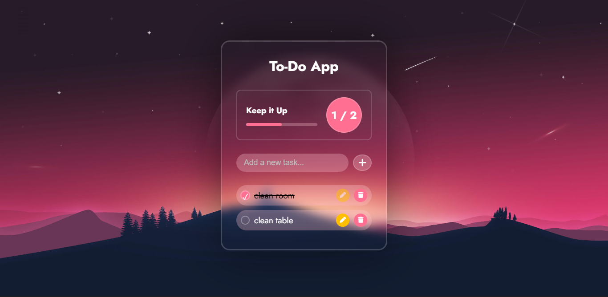

# ✅ To-Do List App (Vanilla JavaScript)

A simple, responsive and interactive **To-Do List** application built using  
**HTML, CSS, and Vanilla JavaScript**.  
Users can add tasks, mark them completed, delete tasks, and progress is saved automatically in **LocalStorage**.

### 🔗 Live Demo

👉 https://navaneethtp.github.io/To-Do-List/

---

## 📸 Preview

(You can rename the screenshot in your repo as screenshot.png or update the path.)

---

## 🚀 Features

✅ Add new tasks  
✅ Mark tasks as completed  
✅ Delete tasks  
✅ Task count + progress indicator  
✅ Beautiful glassmorphism UI  
✅ Fully responsive (mobile & desktop)  
✅ Stored in **LocalStorage** – data never lost  
✅ Smooth icons & animations

---

## 🛠 Tech Stack

- **HTML** – Page structure
- **CSS** – Design + responsive layout
- **JavaScript** – App logic + LocalStorage

---

## 📌 How It Works

- When a user adds a task, it is saved in LocalStorage
- Completed tasks update automatically
- Deleting removes from UI + LocalStorage
- On refresh, all tasks load again

---

## 🧑‍💻 Author

Developed by **Navaneeth** ✨  
Free to use and improve.